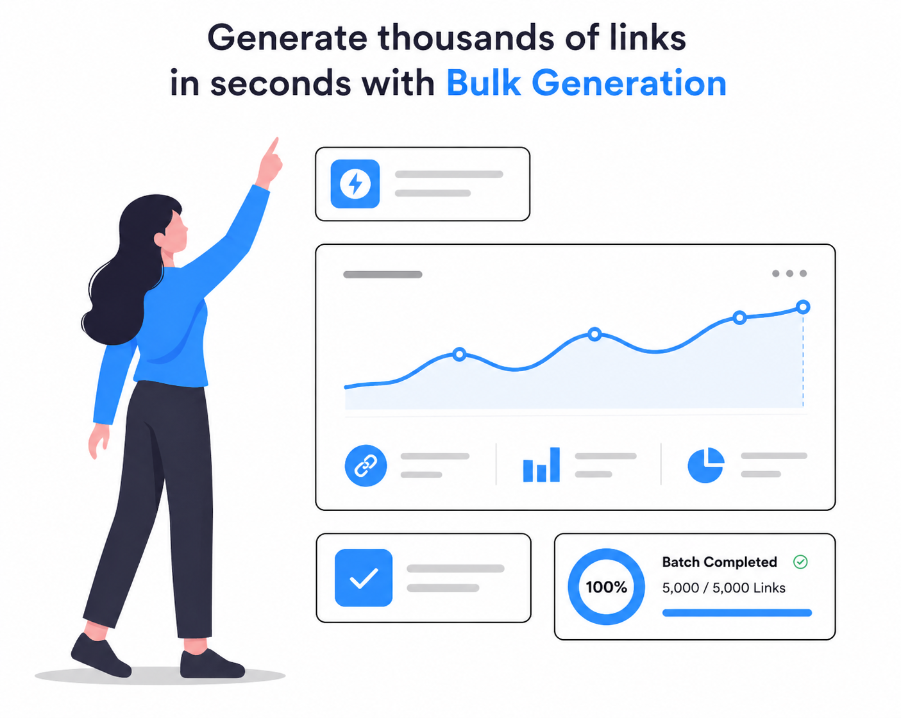

<div align="center">
  
  <h1>🔗 FastURL</h1>
  <p><strong>The All-in-One Link Management Platform</strong></p>
  <p>
    <a href="https://fasturl.in">Website</a>
    ·
    <a href="#features">Features</a>
    ·
    <a href="#quick-start">Quick Start</a>
  </p>
</div>

<hr />

## 🚀 About FastURL

**FastURL** is an all-in-one link management platform designed for digital marketers, developers, and businesses. It transforms long, complex URLs into short, clean, and shareable links, while providing a full suite of tools including tracking, dynamic QR codes, bulk operations, and custom domains—all with a focus on speed, security, and simplicity.

---

## ✨ Key Features

1. ✂️ **URL Shortener:** Instantly convert long URLs into compact links with optional custom aliases. Edit the destination URL at any time.
2. 📱 **QR Code Generator:** Generate dynamic QR codes directly from any URL. Update the destination without reprinting the code!
3. 📦 **Bulk URL Shortener:** Shorten hundreds of links simultaneously via CSV upload or list paste. Perfect for marketing campaigns.
4. 🌐 **Custom Domains & Branded Links:** Connect your own custom domain (e.g., `link.yourbrand.com`) using DNS records (CNAME + TXT).
5. 📊 **Link Analytics Dashboard:** Real-time click tracking including unique clicks, geolocation (country, state, city), device, browser, and referrals.
6. 🔒 **Link Management & Security:** Password-protected links, link expiration (by date or click limit), SSL/HTTPS encryption, malware protection, and 2FA.
7. 💻 **Developer API:** Programmatically create and manage short links using API keys.

---

## 📸 Screenshots

| Dashboard & Analytics | Link Management |
| :---: | :---: |
|  |  |
| **QR Code Generator** | **Bulk Shortening** |
|  |  |
| **Developer API** | |
|  | |

---

## 🛠️ Technologies Used

- **Framework:** [Next.js](https://nextjs.org/) (React)
- **Styling:** [Tailwind CSS](https://tailwindcss.com/) & [Shadcn UI](https://ui.shadcn.com/)
- **Database ORM:** [Prisma](https://www.prisma.io/)
- **Authentication:** [NextAuth.js](https://next-auth.js.org/)
- **Caching & Rate Limiting:** [Upstash Redis](https://upstash.com/)
- **Payments:** [Dodo Payments](https://dodopayments.com/) & [Razorpay](https://razorpay.com/)
- **Analytics:** Vercel Analytics & Speed Insights

---

## 🚦 Quick Start

### 1. Prerequisites
Ensure you have the following installed:
- [Node.js](https://nodejs.org/) (v18+)
- [npm](https://www.npmjs.com/) or [yarn](https://yarnpkg.com/) or [pnpm](https://pnpm.io/)
- A PostgreSQL database (or any compatible database supported by Prisma)
- Redis instance (Upstash recommended)

### 2. Installation
Clone the repository and install the dependencies:

```bash
# Clone the repository
git clone https://github.com/ad1tyaydv/fasturl.git

# Navigate into the directory
cd fasturl

# Install dependencies
npm install
```

### 3. Environment Setup
Copy the example environment file and fill in your values:

```bash
cp .env.example .env
```
Key variables to configure in `.env`:
- `DATABASE_URL`: Your database connection string.
- `NEXTAUTH_SECRET`: A secure random string for NextAuth.
- `GOOGLE_CLIENT_ID` / `GOOGLE_CLIENT_SECRET`: For Google OAuth authentication.
- `UPSTASH_REDIS_REST_URL` / `UPSTASH_REDIS_REST_TOKEN`: For Upstash Redis.
- `RESEND_API_KEY`: For sending emails.

### 4. Database Initialization
Generate the Prisma client and push the schema to your database:

```bash
npm run build
# OR run migrations specifically:
npx prisma generate
npx prisma db push
```

### 5. Running the Development Server
Start the Next.js development server:

```bash
npm run dev
```

Open [http://localhost:3000](http://localhost:3000) with your browser to see the application.

---

## 🤝 Contributing

Contributions are welcome! Please feel free to submit a Pull Request or open an Issue for any bugs or feature requests.

1. Fork the Project
2. Create your Feature Branch (`git checkout -b feature/AmazingFeature`)
3. Commit your Changes (`git commit -m 'Add some AmazingFeature'`)
4. Push to the Branch (`git push origin feature/AmazingFeature`)
5. Open a Pull Request

---

## 📞 Support

- **Email:** fasturl@tutamail.com
- **Help Desk:** Available via the website dashboard.
